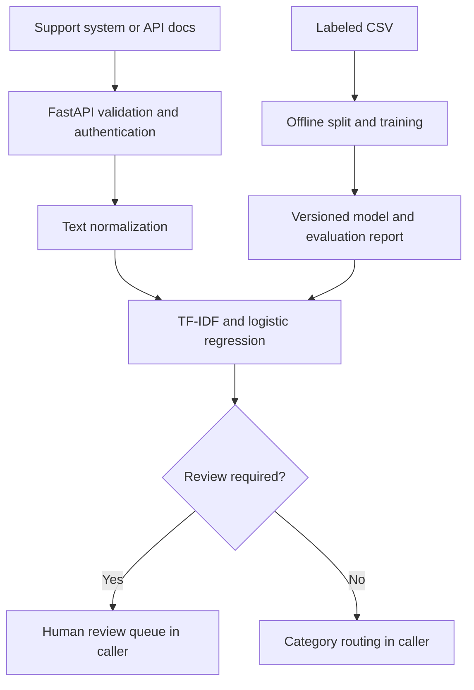

# Customer Support Message Classifier

Runnable Python API and offline machine-learning pipeline for three categories: `billing`, `technical_issue`, and `general_inquiry`. No paid API key, GPU, external model download, or database is required. Includes 96 synthetic messages, tests, Docker configuration and GitHub Actions CI.

**Readiness:** The application includes deployment controls, but the supplied model is a demo. Every demo prediction requires human review, and production mode refuses demo models. Real business accuracy cannot be established without representative labeled customer messages. Docker configuration is included but was not executed in the delivery environment.

## 1. Setup and installation

Prerequisites: Python 3.11 or 3.12; alternatively Docker with Compose. Run all commands from this directory.

### Windows PowerShell

```powershell
py -3.11 -m venv .venv
.\.venv\Scripts\python.exe -m pip install -r requirements-dev.txt
Copy-Item .env.example .env
.\.venv\Scripts\python.exe -m app.train --demo
.\.venv\Scripts\python.exe -m uvicorn app.main:app --host 127.0.0.1 --port 8000 --no-access-log
```

Using the virtual environment's Python directly avoids PowerShell activation-policy errors. If Python 3.12 is installed, substitute `py -3.12`.

### Linux / macOS

```bash
python3 -m venv .venv
.venv/bin/python -m pip install -r requirements-dev.txt
cp .env.example .env
.venv/bin/python -m app.train --demo
.venv/bin/python -m uvicorn app.main:app --host 127.0.0.1 --port 8000 --no-access-log
```

Open http://127.0.0.1:8000/docs for the interactive API interface. Expand **POST /v1/classify**, choose **Try it out**, enter the message and execute. This provides an immediately usable UI without a separate frontend. Development authentication is disabled unless you set `API_KEY`.

### Docker

```bash
docker compose up --build -d
docker compose logs -f
docker compose down
```

The image trains a demo model during its build and serves it as a non-root user. Compose binds to localhost, uses a read-only filesystem, removes Linux capabilities and sets a restart policy. It intentionally runs in development mode until real data is supplied.

## 2. How the actual solution works



The API returns a category, class probabilities, review reasons and model version. Your support application consumes the response and decides whether to assign a ticket to a team or put it in a review queue. This project does not send messages, create tickets, or automatically act on billing requests. Human review storage and ticket-system integration belong to the calling application.

Example request (Linux/macOS or Windows `curl.exe` with appropriate shell quoting):

```bash
curl -X POST http://127.0.0.1:8000/v1/classify \
  -H 'Content-Type: application/json' \
  -d '{"text":"I was charged twice. Please refund the extra payment."}'
```

PowerShell alternative:

```powershell
$body = @{text = 'I was charged twice. Please refund the extra payment.'} | ConvertTo-Json
Invoke-RestMethod -Uri http://127.0.0.1:8000/v1/classify -Method Post -ContentType 'application/json' -Body $body
```

Response shape (numbers below are illustrative):

```json
{
  "category": "billing",
  "confidence": 0.72,
  "probabilities": {"billing": 0.72, "technical_issue": 0.16, "general_inquiry": 0.12},
  "requires_review": true,
  "review_reasons": ["demo_model"],
  "model_version": "artifact-hash",
  "demo_model": true
}
```

| Route | Purpose | Authentication |
|---|---|---|
| `POST /v1/classify` | One message, 1–10,000 characters | API key when configured |
| `POST /v1/classify/batch` | `{"messages":[{"text":"..."}]}`, 1–100 items | API key when configured |
| `GET /health/live` | Process health | Public |
| `GET /health/ready` | Loaded model/version | Public |
| `GET /docs` | Interactive Swagger UI | Public |

Clients should send `X-API-Key` when a key is configured. HTTP 401 means failed authentication; 422 means invalid input; server startup fails for missing, corrupt, incompatible or prohibited demo artifacts. Uvicorn's configured concurrency cap can return 503 under overload. Predictions run in a worker thread so CPU inference does not block the async request loop.

## 3. Data needed

Use consented/anonymized historical support messages and human-reviewed category labels. CSV must contain `text,label` columns, UTF-8 encoded. Example:

```csv
text,label
"My invoice has an incorrect charge",billing
"The app crashes when I open it",technical_issue
"What are your opening hours?",general_inquiry
```

At least 10 distinct messages per category are required by the trainer for a meaningful basic split; this is a software minimum, not an accuracy guarantee. Aim for hundreds or thousands of diverse real messages per category, including short messages, spelling mistakes, jargon, mixed intent and examples from all important channels. Define a labeling handbook and resolve disagreement between annotators. Do not commit actual customer data to Git.

For production evaluation, keep conversation/customer identifiers and timestamps in your governed dataset outside this repository. Split by conversation/customer and preferably time before preparing training and test datasets; messages from one conversation must not leak across splits. The included trainer uses a stratified random split and only removes normalized exact duplicates. It does **not** prevent near-duplicate or conversation leakage.

## 4. Preprocessing and implementation

1. Validate message type, length and nonblank content.
2. Normalize Unicode with NFKC and lowercase text.
3. Replace email addresses, HTTP URLs and simple long numeric identifiers with placeholder tokens.
4. Collapse whitespace; preserve negations such as "not" and useful domain vocabulary.
5. Deduplicate normalized training text and reject duplicates with conflicting labels.
6. Fit word unigrams/bigrams with TF-IDF using training data only, limited to 30,000 features.
7. Train class-balanced multinomial logistic regression and evaluate on the held-out 25% split.
8. Save the evaluated pipeline, checksum/version metadata and JSON evaluation report.

The normalization function is shared by training and serving. Regex replacements are basic privacy reduction, not comprehensive PII anonymization: names, addresses, sensitive free text and shorter identifiers can remain. No raw request bodies, query strings or API keys are logged or persisted by application logging; logs contain generated request ID, method, status and elapsed time. Validation errors also avoid echoing submitted content.

## 5. Model choice and design decisions

TF-IDF + logistic regression is a CPU-friendly supervised baseline for a small, fixed set of categories. It offers small artifacts, fast inference, reproducible training and class probability scores. It keeps customer text within your infrastructure and requires no cloud model credentials. See [scikit-learn feature extraction](https://scikit-learn.org/stable/modules/feature_extraction.html) and [logistic regression](https://scikit-learn.org/stable/modules/generated/sklearn.linear_model.LogisticRegression.html).

Assumptions:

- English input and one primary intent per message; multilingual, sarcasm and multi-intent messages are limitations.
- Three fixed categories; changing categories requires updating `LABELS`, tests, training data and retraining.
- Human review is the fallback. Confidence below `CONFIDENCE_THRESHOLD`, zero known vocabulary, or demo artifacts sets `requires_review=true`.
- Probability scores are not guaranteed calibrated. The default 0.65 threshold is a starting point and must be selected using a separate real validation set based on routing risk and review capacity.
- Artifacts are administrator-controlled, loaded once at startup and replaced via new deployment/restart. The service never retrains on requests.
- `general_inquiry` is a normal class, not a reliable detector of unrelated text. Vocabulary checks do not fully solve out-of-domain detection.

Compare the baseline with a fine-tuned transformer on real data if semantic variation or multilingual requirements justify more dependencies and compute. Keep the simplest model meeting your measured acceptance criteria.

## 6. Evaluation and tests

```bash
python -m pytest -q
python -m app.train --data data/demo.csv --output models --demo
```

Run these with your virtual environment's Python (Windows: `.\.venv\Scripts\python.exe`; Linux/macOS: `.venv/bin/python`). `models/evaluation.json` records accuracy, macro F1, per-category precision/recall/F1, class-ordered confusion matrix, review coverage and accuracy among accepted predictions at threshold 0.65. The saved model is the same model evaluated on the held-out split; it is not silently retrained on test data.

`reports/demo-evaluation.json` is the delivery-time synthetic evaluation, useful for checking execution only. Synthetic results do not estimate production accuracy. Automated tests cover all three categories, API authentication, invalid requests, batch limits, preprocessing, unfamiliar vocabulary, demo review flags, artifact integrity, training-data failures and production startup restrictions.

For a real launch, agree per-class recall/precision and accepted-routing accuracy goals, measure against a locked real test set, choose threshold on separate validation data, inspect errors and test latency/load on your target hardware. Review missed billing/technical cases separately rather than relying on overall accuracy. Monitor category distribution, review fraction, latency, errors and human-corrected routing quality over time. This package emits request logs but does not include a monitoring backend or load-test result.

## 7. Train and deploy with real data

```bash
python -m app.train --data /secure/path/labeled_messages.csv --output models
```

Do not use `--demo` for real data. Conversely, always use `--demo` when training synthetic data. The flag is an operator assertion; the software cannot prove dataset provenance. Evaluate and approve the resulting model before deployment.

Generate a secret:

```bash
python -c "import secrets; print(secrets.token_urlsafe(32))"
```

Set `.env` locally (never commit it):

```dotenv
APP_ENV=production
API_KEY=your-generated-secret-at-least-32-characters
MODEL_DIR=models
CONFIDENCE_THRESHOLD=0.65
```

Start using the command in the setup section. Production startup enforces a key of at least 32 characters and rejects demo-marked models. Use a secret manager for deployed environments.

For Docker production serving, train a real model on the same pinned dependencies and mount that directory instead of the image's demo artifact:

```bash
docker build -t support-classifier:1.0.0 .
docker run -d --name support-classifier \
  -p 127.0.0.1:8000:8000 \
  --env-file .env \
  --mount type=bind,source="$(pwd)/models",target=/app/models,readonly \
  --read-only --tmpfs /tmp --cap-drop ALL --security-opt no-new-privileges \
  support-classifier:1.0.0
```

On Windows, use Docker Desktop and an absolute model-directory path in the bind mount. Linux-host model files need permissions readable by UID 10001.

Before exposing the service publicly, put it behind a TLS reverse proxy/API gateway with request-body limits (e.g. 5 MiB), authentication-aware rate limits and request timeouts. Application field limits apply after JSON parsing, so the proxy body limit is required to protect memory. Scale using independent processes/replicas; each loads its own model. Disable request/body logging in your proxy and secure observability configuration. Rotate keys through deployment; multiple client keys and per-user authorization are not implemented here.

Model `joblib` files use pickle and may execute code when loaded. Only load trusted internal artifacts. The checksum detects accidental mismatch; it is not a signature and cannot authenticate a malicious model with matching metadata. Use a trusted registry or signed release pipeline in production. Reference: [scikit-learn persistence security](https://scikit-learn.org/stable/model_persistence.html). Train into a separate directory and publish the model, metadata and evaluation together as an immutable release; do not retrain into a directory actively being used for startup.

Pinning direct dependencies provides predictable core versions. Scan dependencies/images, update pins as needed and rerun tests; no vulnerability audit or production infrastructure certification is claimed. The base Docker tag and transitive dependencies are not fully locked; use a digest-pinned base and a reviewed complete lockfile in your deployment pipeline.

## 8. Potential risks and limitations

| Risk | Mitigation / remaining limitation |
|---|---|
| Insufficient or biased labels | Diverse real data, written labeling rules and disagreement review |
| Leakage from repeated conversations | Group/time split in dataset preparation; exact deduplication alone is insufficient |
| Mixed intents or unknown domains | Human review and future multi-label/out-of-domain evaluation |
| Incorrect high-confidence predictions | Real validation, calibrated scores and threshold selection; scores are not certainty |
| Typos, new products, multilingual text | Monitor mistakes and periodically retrain; current model assumes English |
| Sensitive information | No application body logging; governed data handling and comprehensive anonymization upstream |
| Traffic spikes / oversized JSON | Gateway limits, rate limiting, timeouts, concurrency cap and hardware load testing |
| Drift | Capture consented human corrections outside this service and compare model releases |
| Unsafe artifacts | Trusted immutable artifact releases; checksums alone are not authentication |

## 9. Files and Git publishing

- `app/main.py`: inference API, lifecycle validation, authentication and request logging.
- `app/train.py`: labeled CSV validation, split, training, persistence and evaluation.
- `app/text.py`: shared preprocessing.
- `data/demo.csv`: synthetic examples only.
- `tests/test_solution.py`: functional and failure-path tests.
- `models/`: generated local artifacts (excluded from Git).
- `reports/demo-evaluation.json`: delivery-time synthetic metrics.
- `Dockerfile`, `compose.yaml`: container runtime.
- `.github/workflows/ci.yml`: tests, training and Docker build on push/PR.

To create a new Git repository after extraction:

```bash
git init
git add .
git commit -m "Add support message classifier API and training pipeline"
git branch -M main
git remote add origin https://github.com/YOUR_USERNAME/YOUR_REPOSITORY.git
git push -u origin main
```

If copying into an existing repository, use its normal branch and pull-request workflow instead. `.env`, real CSV datasets, generated models, caches and virtual environments are ignored. Review staged files before committing. No Git remote was changed or pushed as part of preparing this ZIP.
